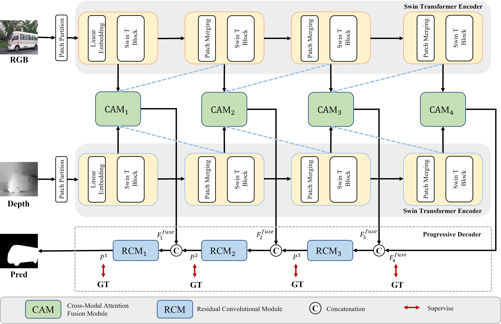
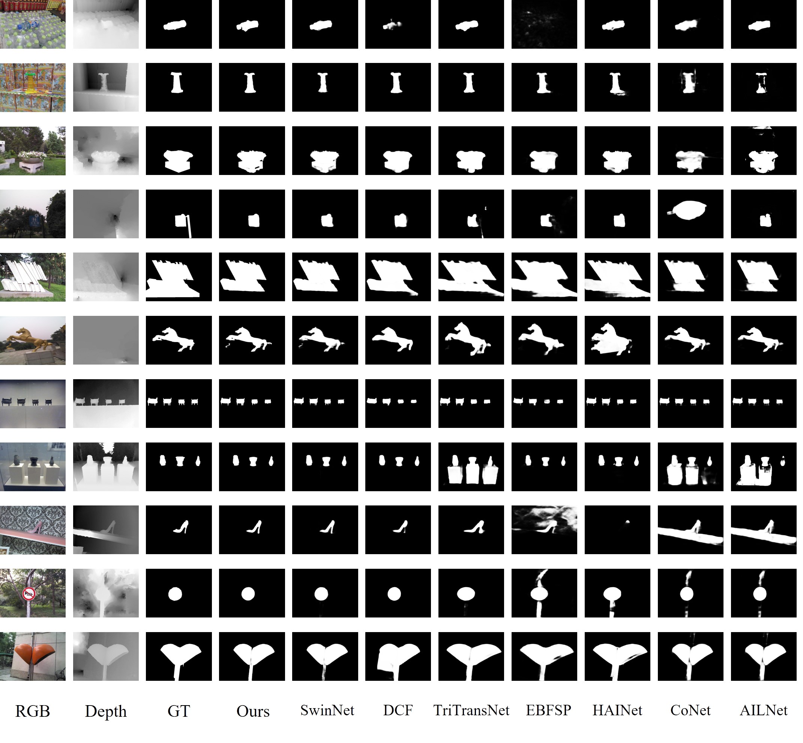
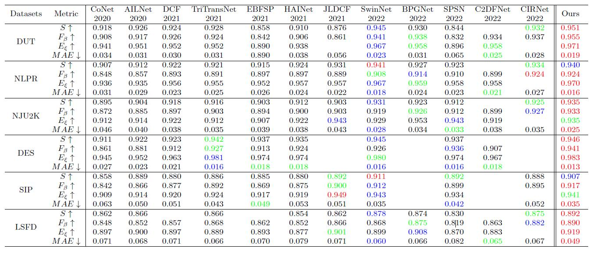

# **Cross-Modal Fusion and Progressive Decoding Network For RGB-D Salient Object Detection**

## Network Architecture

## Results and Saliency maps
We perform quantitative comparisons and qualitative comparisons with 12 RGB-D SOD
methods on six RGB-D datasets.

## Proposed Baseline
### Download pths
Download the following `pth` and put it into main folder
- [Swin-B](https://pan.baidu.com/s/1VkWOrdrw3RHOp0Ir5rLGgw) with the fetch code:ja95.

### Results
You can download the results pth - [Baidu Pan link] (https://pan.baidu.com/s/1x6wQf-RceapsZanH4PfbGg) with the fetch code:50lu.
